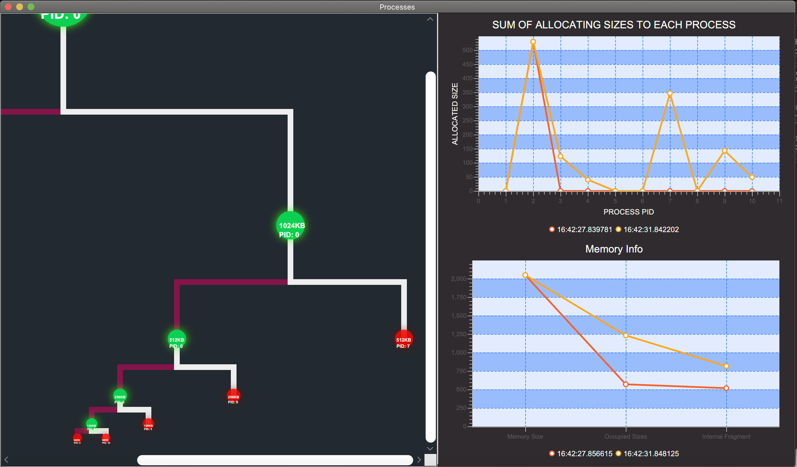

# Buddy Memory Allocation 

The [buddy memory allocation](https://en.wikipedia.org/wiki/Buddy_memory_allocation)  technique is a memory allocation algorithm that divides memory into partitions to try to satisfy a memory request as suitably as possible. This system makes use of splitting memory into halves to try to give a best fit.

## Process
In this Project, I Used Threads For Random Requesting Allocation And DeAllocation Of Blocks In Memory For a Random Number Of Requests.
For Example, Every 3seconds(Which Is Random Whenever One Block Is Requested) Processes, Will Request The Allocating Block Of Size 32kb, etc.
When Their Request Count Is Over, They Will Free All Blocks(Addresses Of Memory) They Haven't DeAllocated.   

## Algorithm 
Algorithm and data structures used in this project:
   * Binary Search Tree
        - Which used for finding the free blocks by dividing the larger blocks.
   * [First Fit](https://www.geeksforgeeks.org/program-first-fit-algorithm-memory-management/) 
        - Which used for finding addresses for allocating in each block of tree.

## Reporting 
For reporting the each process I used three technique(Operate Every 5 Seconds):
   * UI Thread Which Shows:
        - The current state of tree (Which Block Is Occupied And Which Process Has This Block) 
        - The current state of memory (Total Free Spaces And Internal And External Fragment)
        - The current state of processes (Total Spaced Which Is Used By This Process)
   * Reporter Thread Which Shows(In Json Format):
        - Start Time Of Process
        - End Time Of Process
        - Execution Time Of Process
        - Address Which Used By This Process
        - Total Allocated Space of Each Process 
        - Process Is Finished Or Not
   * Logger Thread Which Using The Reporter Thread Json Data And Writes It In File Based On Time(./log folder). 

## Start 
bash```
    mvn clean javafx:run
‍‍‍‍‍‍

## Screen Shot
* Start Of Execution:
    

* Middle Of Execution:
    

* End Of Execution:
    

## Video
* Video Of Execution:
    
